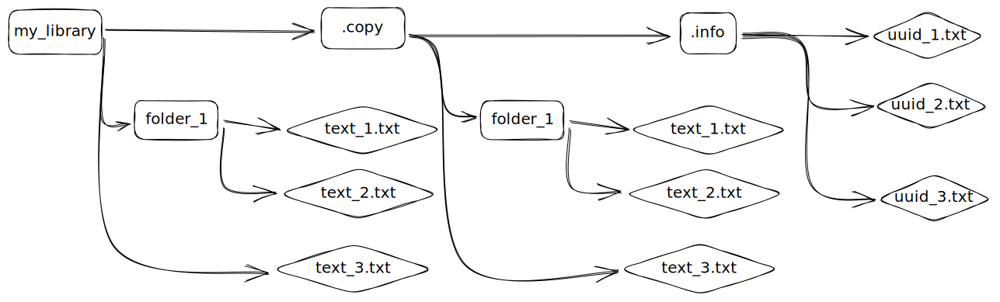

# How does the file Transfer works ?

### Quick Introduction
The aim of this feature is to distribute as quick as possible a file among multiple nodes. 
Moreover, all nodes having the same logical name should have the same files in their library. A library is just a repository on the node 's machine where all the distributed files are stored.
In addition, the system should be self-managing. It adapts to the configuration in which it is used, thus ensuring the best efficiency in most situations.For instance, this sharing must work for 1MB files as well as 10GB files. And it must be efficient, whether there are 2 nodes in the pool or 40 nodes in the pool.
Many directions have been taken during the developpment and this version might not be the optimal one.

### Useful Vocabulary
- **seeder**: node that has the entire file and distributes it to others
- **leecher**: node that has the file but incompletely: it shares and downloads the file at the same time
- **piece**: a file is broken down into different pieces of equal size. The pieces are between 256Kb and 1Mb. We try to make sure that there are maximum 10 000 pieces.
- **block** : a piece is decomposed in different blocks of 16Kb size. Thus, a piece is composed of 16 to 64 blocks.
- **bitfiled** : list where there is the number of pieces that the node has
- **pool** : set of nodes having the same logical name
- **library** : it designs the set of files that a nod has. 
- **hashMap** : dictionnary of all the pieces id and the hash correspondig to this piece

## Overview of the Principles


This is how a library is organised. When we create a shoset, we can set a folder to be the library. Inside the .copy directory is a replica of the library. We call the file inside *copy files*. Inside the .info are some information about the temp files. This is used to keep a fingerprint of the each file and avoid rescanning the entire library at each time.

The .copy folder is always synchronised with the other node. When some modifications are made by the node, it is then copied to the .copy folder and synchronised with all the other nodes.When we received a new file for instance in the .copy directory, we copy it to the library.

When the libray has changed and a file has been modified (or a new file appear), all the nodes in the same Logical Name (LName) must download it. They get the hashMap of the pieces of the file (dictionnary with the piece number and the hash of the piece) and start to download it. Like Bittorrent Algorithm, there is no central node deciding who send which pieces to who, but each node ask to the other the pieces that they miss. In order to be fast, 2 nodes shouldn't download the same node from the seeder all along. 
They should also download from each other if possible. To do so, a node know exactly the *bitfield* of the other nodes. A *bitfield* is a dictionnary storing the id of pieces that a node have. So each node know exactly which nodes have which pieces. A node always ask for the rarest piece on the network so that they can give it to the others afterward.

## How the download works
A file is separated into pieces of length between 256KB and 1MB (depending on the size of the file). Each pieces is separated into blocks of 16KB.
The main difficulty with file transfer is to know how much data we can send / ask to another node. We don't want to overflow the network nor to underuse it.  We decided to build a TCP-like algorithm. We begin with asking small packets of 16KB 2 by 2. Then, if there is no timeout and after a certain time, we can upgrade what we can call a *level*. We ask the data 4 by 4, then 8 by 8, ... until we ask 16 by 16 for a 256KB piece or 64 by 64 for a 1MB piece. When we reach this level, we begin to ask pieces by pieces, then 2 pieces by 2 pieces and so on.
When we detect a timeout in a packet we asked or when we detect that the network is congested, we decrease from one level. We also temporary slow our demand to wait for the timeout pieces. After a period of time, we can increase again.
This algorithm is not exactly the same as TCP but is good enough to adapt to any type of networks with different bandwidth. 

A major difficulty is to fix the different variables as the timeout or the time before 2 increase. For now, these variables are arbitrary fixed but it can be changed.
Another difficulty is to detect a congestion on the connection, and to know what to do with it.

#### What do we do when we find a slow down ?
Imagine we have identified a connection that just became bad after a good rate. What de we do with that ? The first idea is to warn the other node that ther is a slow down and we can reduce our downloading rate by decreasing from one level. But this slow down may be caused by another node which just connected and asked for too much data (or sent too much data). So we are penalizing the wrong node.
The big problem is that we don't know the topology of the network. Therefore, we can't know which node we should blame for this slow down.
The method implemented is to penalize also the nodes that have the most pieces because there are less hurried to download pieces. So we penalize randomly the nodes, those who have a higher rate are more likely to be blamed.
This is not the optimal solution, we should dig deaper this question.


#### How we monitor the flow rate :  Using the system.calls to access TCP information
TCP protocol already have a congestion avoidance algorithm. On Linux, we can access this data because we can access the system calls (on Windows, it is not accessible). 
These are a lot of data. The most interesting is the *RTT* (Round-Trip delay Time). It is the time (in average) between the moment we send the packet and we receive the acknowledgment.  If we see that the RTT increased a lot, the connection is then a slow connection.
This data is also stored in *flowrate.csv* in the folder *.info*. It can be usefull to analyse it after a download.

#### How does the user / programm do changes in the Library ?
The user / programm will have to go through fucntions (add, delete, move, modify) to perform operations. But instead of only doing these operations, it go through a lock system. 
Just before doing the operation, the node try to "lock" the library.
The *Lock* function will ask to the other node in the same LName if it can edit the library. If the library is not up to date or an operation is performed on another node, the answer is no : the function then return an error. At the end of the operation, the library is "unlocked".
For now, this solution is not fully tested but works for the *Add* function.

## Structure of the code
- Inside the shoset repository, we have the directory **file** where all the codes linked to file manipulation is stored. Each file in the library and in the copy of the library has a **file** instance. It is mostly used to read file, write to a file, calculate the hash of the file.
- We also have a specific file in the folder **msg** called *fileTransfer.go* which is used to send file information on the network
- *handleFileTransfer.go* takes care of handling the file messages received
- *syncFiles.go* add functions to the shoset instance
- **file_test** have a few unit tests from **file**

### Inside the file folder
- *file.go* : it has the File interface ant the FileImpl structure. This is used to do operations on one file (read, write data, calculate hash of the file, have the version, ...).  Each file in the library and in the copy of the library has a **file** instance. 
- *syncFile.go* : it has the SyncFile interface and the SyncFileImpl structure. It makes the link between the real file (the file in the library) and the copy file (the file in the .copy folder). Each SyncFile has a uuid (unique identifier). This uuid is used to identify the file we are talking about. It is usefull when a file is renamed. SyncFile is also used to keep track of the operations made on the file and to update the files in both the library or the library copy.
  It also has the FileState structure used to get some information about a SyncFile
- *operations.go* : it is used to identify an operation made on a file (add, modifiy, remove, move)
- *fileLibrary.go* : this instance is used to manage the library (mostly to add or remove a file) , e.g to track all the files in the library
- *externalCommands.go* : This package provide accessible commands to the user. The commands are : move, delete, add, modify. Use these commands to modify a file in the library to do it safely. It asks to the other node for their permission to modify the library.
- *fileSeeder.go* : this small structure is used when a node ask us a chunk of a file. We load the data and send it back
- *fileLeecher.go* : it kinds of inherits from fileSeeder. This huge structure is in charge of downloading a single file from other nodes (and also uploading the parts we received thanks to the fileSeeder). This is inspired by the bittorrent protocol.
- *connInfo.go* : it stands for Connection Information. It keep tracks some information about a connection with another node when we are downloading a file. In particular how much data we can ask him at the same time. This amount is separated into levels and specific strategy is runned to keep the optimal download rate. There is a connInfo instance per fileLeecher per conn.
- *piece.go* : A file is separated into pieces of lenght between 256ko and 1Mo. The piece instance is used to store some information about a piece (including the hash of the piece). As a piece length may be to big to be asked / sent on the network, a piece can be divide into small blocks of 16ko.
- *logRateTransfer.go* : It stores in a csv file the flowrate of each connection. Initialy, it was used to store the upload and download rate. With the new variable used to monitor the flowrate, it is only storing this variable :  the RTT of each request. 
- *fileMessageQueue.go* : It implements a queue with a channel and lock functionnality. It is used if FileTransfer to handle messages to send and to receive.
- *fileTransfer.go* : The most important file. It handles all the functionnality and messages of the file synchronisation process. It also has a Rate structure to monitor theflow rate and prevent congestion.

## Goroutine
We use multiple goroutines to have more efficent file transfer. Before the file transfer, they were a goroutine per TCP connection. Now, there is also a goroutine to handle send messages and received messages per connection. This is why Locks are used to handle access to ressources.

#### Locks
We use *sync.mutex* to lock and unlock structure / objects. Some objects ahve only Lock and Unlock, some other have also RLock and RUnlock (for only read : do not block other reader)


# Tools

### Ifacemaker
This tool can be used to generate an interface from a structure.
link to install : https://github.com/vburenin/ifacemaker
Example : 
```bash
ifacemaker -f file/file.go -s FileImpl -i File -p file
# generates the interface File for the structure FileImpl and the package file
```

### Mockgen
This tool can be used to simulate the behaviour of an object. When we have an interface, it creates a structure so that we know which functions are called. To generate it :
```bash
mockgen -destination="test/mocks/file/fileLibrary.go"  -source="file/fileLibrary.go"
```
It can then be used in tests by adding generally Mock before the interface name.


# Tests
Some Unit tests have been made in the file_test folder. 

### Simulate traffic limitation
- To do test with different bandwidth limitation, you can use the tool *TrafficTroll*
There is the file *test/traffic.yaml* which is the configuration.
link to install : https://github.com/cryzed/TrafficToll
Example :
```bash
sudo tt lo ./file_test/traffic.yaml --delay 0.5
# tt is in ~/.local/bin
```
- The tool *trickle* doesn't work with golang. 
- You can also use *iproute2* and *tc* but it is more complex to handle.

