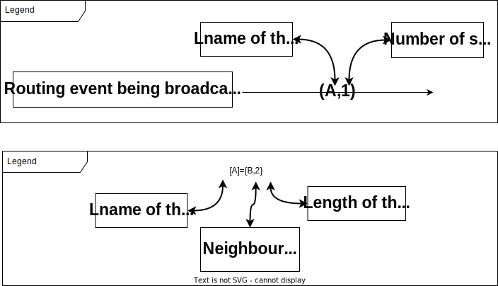
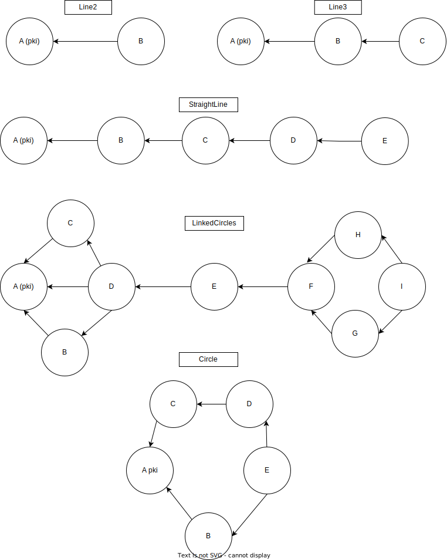

This file is what I would have liked to have on hand when I started on the project to understand how it works.

This is **not an exhaustive documentation** of the project (There is no such thing right now, but you are welcomed to create one).

Please keep this file concise and up to date with the latest changes when leaving the project, think about the next guy.

This project contains code that is cryptic, suboptimal or that doesn’t behave as expected (and sometime all of the above), don’t be afraid of improving it.

If you struggle to understand something, please come back here to explain it once you’ve figured it out.

# Shoset :

Shoset is a smart Socket library, **resilient**, **distributed** and with **high availability**.

**Resilient :** automatic reconnection and no startup order (As long as every shoset is certified.) .

**Distributed :** with the brother system, any **shoset** can fail with no disruption to the network if it is not alone in its logical name.

**High availability :** Built in redundancy.

Send and receive data in the form of messages between **shosets**.

## Vocabulary :

- **Shoset :** A smart socket from this library.
- **Logical name** (**Lname**) (string) : A name describing the role of the **shoset** in the network, 2 **shosets** with the same **Lname** have the same role and can be used interchangeably. 
**Shosets** with the same Lname are **brothers.**
- **Brother :** Remote **Shoset** of the same **Lname**, state is synced between them.
- **Message :** How **shosets** exchange data.
- Types of connection between two **Shosets** :
    - **Join :** Everybody has a direct link to everybody in a **join**.
    - **Link :** Connection are only established point to point in a **link**.
- **PKI system :** In order to join the network by establishing a connection to another **shoset**, it must be certified by the **CA** (certificate authority) **shoset** of the network.
- **Certification :** Obtaining a certificate from the **CA** **shoset**.
- **Network :** every **shosets** connected together.

## Module Architecture :

### Diagrams :

 In svg form in the `./uml` folder. (Open it with a web browser for highlightable and copy-pasteable names.)

**Class diagram :**

- [https://github.com/jfeliu007/goplantuml](https://github.com/jfeliu007/goplantuml)

**Call diagram :**

- Call diagram are also available but are not very readable.
- [https://github.com/ofabry/go-callvis#interactive-viewer](https://github.com/ofabry/go-callvis)

Update diagrams with script : `./uml/generate_diagrams_svg.sh` (Installation instructions for necessary software in the comments of the script.)

(Also see tools : cpu profiler, memory profiler, tracer, …) //Lien vers l’autre fichier avec les explications

**Shoset :** 

- **ShosetConn :** connection to another remote **shoset**.
- **Certification :**
    - To get certified, you need to have a direct or indirect connection to the **CA** **shoset.**
    - To establish a connection with a **shoset**, it must be already certified.
    - Certificates will be reused for the next launch.
- **Route :** Information to forward a message to a **Lname** to which the **shoset** may not have a connection.
- Message type ([Creating a custom message type :](guide%2030e418b93d85452d83f0dc7c627318c7.md)) :
    - **Table of message types :** (config ≠configProtocol)
    
    | Message type :                   | Usage :                                                             | Internal : | Send type :                                      | Forwarding : | Queue : |
    | -------------------------------- | ------------------------------------------------------------------- | ---------- | ------------------------------------------------ | ------------ | ------- |
    | command                          | Command for Gandalf                                                 | No         | Send to every connection                         | No           | Yes     |
    | config                           | Command for Gandalf                                                 | No         | Send to every connection                         | No           | Yes     |
    | configProtocol (link, join, bye) | Used for establishing and breaking connections (join, link, bye, …) | Yes        | None (Handled outside the handler)               | No           | No      |
    | event                            | Send payload to the entire network                                  | No         | Send to every connection                         | No           | Yes     |
    | pkiEvent                         | PKI initialization for establishing secure connexion                | Yes        | Send to every connection                         | No           | Yes     |
    | routingEvent                     | Announce a shoset to the network to establish route to it.          | Yes        | Send to every connection                         | No           | No      |
    | simpleMessage                    | Simplest  forwardable message type                                  | No         | Use route system to send only to the destination | Yes          | Yes     |
    | ForwardAck                       | Acknowledge the reception of a forwarded message.                   | Yes        | None (Handled outside the handler)               | No           | Yes     |
    - Every messageType has :
        - Common basic attributes (**MessageBase**) and some type specific attributes (Payload, UUID, TimeStamp, …).
        - An **identifying string** used to access the handler specific to this massage type.
        - Dedicated **handler**. (`./handler_*message_type*.go`)
        - Definition of the message type : specific attributes, Getter/Setter, **identifying string**, … (**`./msg/*messageType*.go`**)
- **Handler :** Set of functions specific to a message type.
    - Explicitly called (Generic version calling the correct function from the handler are available in `shoset.go`):
        - `Send()` : Sends a message.
        - `Wait()` : Waits for a message to be available and returns it.
    - Internal :
        - `HandleDoubleWay()` : Is called when a new message is received, takes actions specific to the message type (Add to **queue**, send to others, …)
        - `Get()` : Is used to retrieve messages before they are processed.
- **Queue :**
    - Where received messages are stored.
    - Messages are automatically deleted from the **queue** after a set (on a per messages basis) number of milliseconds `( int message.timeout (millisecond) )`
- **Iterator :**
    - Used to access the message **queue** and avoid retrieving the same message twice.
    - A message is consumed by a specific **iterator** only for itself (pointer to the same object), and is still available to everybody else.

- **EventBus :**
    - Used for internal communication between goroutines for new available data (message, shoset ready, …)
    - A data race can occur (and is harmless) when an event is published and a channel is unsubscribed before the publication to this specific channel is done.
- **ConcurentSlice :**
    - Thread safe slice with built-in functions to wait for the next change (`WaitForChange()`) or for the slice to be empty (`WaitForEmpty()`).
    - Primarily used to track connection initialization for a **shoset.**
- **MapSyncMap :**
    - Mainly used to store information about **shosetConns** and **shosetConns** themselves.
    - syncMap to a syncmap : `ConnsByLname map[lName](map[remoteAddress]*ShosetConn)`
    - System to save part of the content to the `config.yaml` file.
- **Configuration storage :**
    - Every **shoset**’s configuration is stored in a dedicated folder located at : `~/.shoset` (Home folder).
    - It should be deleted for every test : `rm -rf ~/.shoset`(automatically deleted if you use the scripts (`./test/run_shoset.sh N`) or the VScode launch tasks for the debugger to launch the test).
    - Folder structure :
        
        ```
        https://tree.nathanfriend.io/?s=(%27options!(%27fancy!true~fullPath!false~trailingSlash!true~rootDot!false)~4(%274%270.shoset0*Lname0**BindAddress-36CA3ificate.crt63.crt2CA5%20%7BOnly%20for%20the%20CA%20shoset%7D25-config6config.yaml66%27)~version!%271%27)*%20%20-0***0%5Cn*26private3cert4source!5Key.key6-*%01654320-*
        
        .shoset/
        └── Lname/
            └── BindAddress/
                ├── cert/
                │   ├── CAcertificate.crt
                │   ├── cert.crt
                │   ├── privateCAKey.key (Only for the CA shoset)
                │   └── privateKey.key
                └── config/
                    └── config.yaml (Used to relauch connections automaticaly)
        ```
        
- **Connection types :**
    - **Single way :** Used only for the certification process.
    - **Double way :** Used for normal communication.
- **Certification process :**
    - Use a Temporary connection (**single way**) to obtain certificates from **CA** (certificate authority) **shoset** of the network.
    - The certificate request is forwarded to the CA shoset (not using the **route** system).

### Files and folders of interest :

Everything using the types **Shoset** and **ShosetConn** must be in the **shoset** package and therefore at the root of the project folder.

This makes for a very untidy and confusing project to browse, but given the limitation of golang on where the code can be located, there is no other easy solution.

- handler_*message_type*.go
- shoset.go
- shosetConn.go
- msg
    - *messageType*.go
- const.go
- test/

### Files and folders you should not have to touch :

- msg
    - queue.go
    - iterator.go
    - reader.go
    - writer.go
- pki.go
- concurent_data
- event_bus

## Routing :

Routing enables a **shoset** to send a message (of a forwardable type) specifically to another **shoset** to which it has no direct connection (**forwarding** a message).

A **routing event** only broadcasts the existence of a single **Lname** (and is generated by the **Lname** it is advertising), but it can trigger a **routing event** for other **Lnames** it goes through.

The first **routing event** going through the **network** will trigger the entire network to reroute (Which will generate many messages).

Every change to the network triggers a full reroute.

### Handling of a routing event for a given Lname :

A **routing event** will be broadcasted through the **network** by every node that deems it worth saving.

Every routing event also has a unique ID and a timestamp to always choose the most up-to-date **route**.

| Routing event case :                              | Action :                                                                                                                                  |
| ------------------------------------------------- | ----------------------------------------------------------------------------------------------------------------------------------------- |
| ≠ID and more recent timestamp                     | Save route (no mater the length) <br /> Reroute self (new routing event with new ID) <br /> Rebroadcast Routing event to every connection |
| ≠ID and older timestamp                           | do nothing                                                                                                                                |
| Better route (fewer steps than the current route) | Save route (no mater the length) <br /> Reroute self (new routing event with new ID) <br /> Rebroadcast Routing event to every connection |
| Route to unknown Lname (No route to this Lname)   | Save route (no mater the length) <br /> Reroute self (new routing event with new ID) <br /> Rebroadcast Routing event to every connection |
| Worse route with same ID as the current route     | do nothing                                                                                                                                |

Only one **route** per **Lname** is saved at any give moment by a **shoset**.




### Forwarding :

Trying to send a message to a **Lname** with no **route** will trigger a reroute, and wait for a **route** to the destination to be available. (The new ID will trigger the destination to reroute itself).

When a message is **forwarded** to the next step of the **route**, an **acknowledgment** (`forwardAck`) is expected, if it is not received before the timeout, the **route** is deleted and a reroute is launched.

## File Synchronisation :

This feature is still in developpement.
Each node have a Library (folder on the machine) that will be synchronised with the other nodes belonging to the same Lname.
Basic operations (add a file, delete, move, modify) are supported.
To have a better understanding of the feature, you can read the [File Synchronisation](./fileSynchronisation.md) documentation.


## Using the project :

### Running the project :

Run the script to run the test with : `./test/run_shoset.sh 7` (No need to build it first) (Number to select the test to run.)

To run test on multiple processes in order to test recovery and reconnection, run the VScode task : `RunMultiProcesses`

### Building the project :

```bash
go build -v -o ./bin/shoset_build -race -gcflags=all="-N -l" ./test/test.go
```

`-o` : names the binary
`-gcflags=all="-N -l"` : disables some optimization to enable attaching a debugger to the process

### Code Example :

To run an example : `./test/run_shoset.sh 7` (Change the example that runs in `main() (./test/test.go)`)

**Simplest example :**

```go
func simpleExample() {
	cl1 := shoset.NewShoset("A", "TypeOfA")
	cl1.InitPKI("localhost:8001") // Is the CA of the network

	cl2 := shoset.NewShoset("B", "TypeOfB")
	cl2.Protocol("localhost:8002", "localhost:8001", "link") // we link it to our first socket

	cl1.WaitForProtocols(5) // Wait for cl1 to be ready
	cl2.WaitForProtocols(5)

	//Sender :
	time.Sleep(1 * time.Second)
	event := msg.NewEventClassic("test_topic", "test_event", "test_payload")
	cl2.Send(event)

	//Receiver :
	event_rc := cl1.Wait("evt", map[string]string{"topic": "test_topic", "event": "test_event"}, 5, nil)
	fmt.Println("event received : ", event_rc)
	shoset.Log("event received (Payload) : " + event_rc.GetPayload())
}
```

See more examples in `./test/example.go`

**Topology (`./test/utils_for_test/`) :** 

Defines a set of **Lnames**, assigns an IP address to each and establishes the connections between them.

A set of functions is also available for easy launch of a topology in a single process or a multiprocesses scenario.



### Logger :

**Looging to file :** `command > log.txt 2>&1`

**Logger :** 

There are dedicated instances of a logger in every shoset and shosetConn.

```go
// You can log data to the standard ouput with :
shoset1.Logger.Debug().Str("key", value).Msg("Message to log")
//or
shoset1.Logger.Error().Msg("Message to log.")

//There are many logger levels : Info(),Warn(), Debug(),Trace(), Error(),Panic() and Fatal().

//Set the log level with :
shoset.SetLogLevel(shoset.TRACE)
```

## Creating a custom message type :

Create a new **handler**. (You can use `handler_event.go` or `handler_simple_message.go` as a Template.)

Create a new message type in a dedicated .go file in `./msg` **(Only public fields will be sent, make every field public in the message struct.)** (You can use `SimpleMessage.go` or `event.go` as a Template.)

Add the **handler** and a new **queue** to `shoset.go` (in `NewShoset()`).

Add the identifying string to the lists in `const.go`  :

- of message types (`MESSAGE_TYPES`).
- of forwardable messages if it is forwadable (`FORWARDABLE_TYPES`).
- of `SENDABLE_TYPES`  if the `Send()` function is defined in the **handler.**
- of `RECEIVABLE_TYPES`  if the `wait()` function is defined in the **handler.**