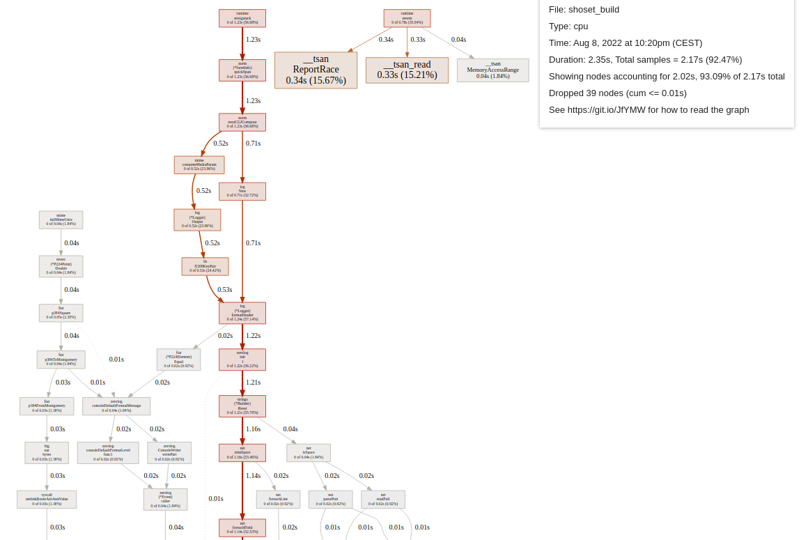
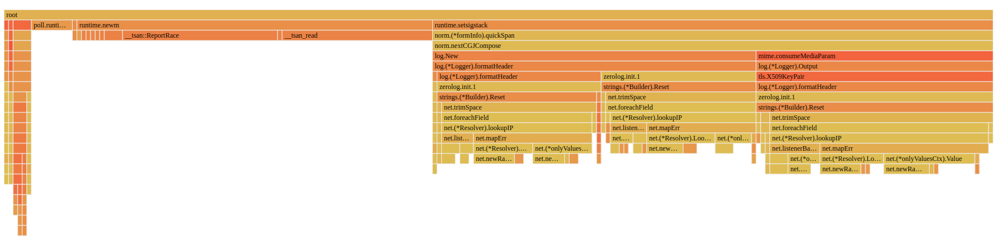
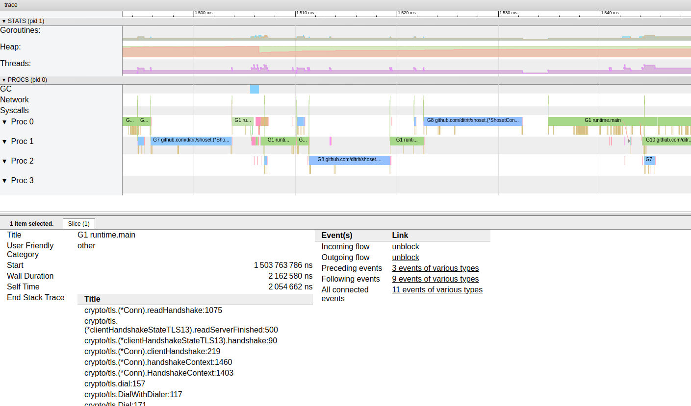

# Tools for debugging and testing :

## VScode task :

**Launching many instances in parallel :**

Add to this task to `./.vscode/tasks.json`.

```json
{
    "label": "RunMultiProcesses_run",
    "runOptions": {},
    "dependsOrder": "parallel", //Launches every subtask in parrallel.
    "dependsOn": [ //There is no way of controlling the order of launch of the parrallel tasks (Terminals are going to be in a random but always the same order)
        "RunMultiProcesses_B",
        "RunMultiProcesses_A"
    ],
    "problemMatcher": [
        "$go"
    ]
},
{
    "label": "RunMultiProcesses_A",
    "type": "shell",
    "command": "RunProcessA",
    "presentation": { // Creates a new terminal in the group and run the task in it.
        "group": "terminalGroup"
    }
},
{
    "label": "RunMultiProcesses_B",
    "type": "shell",
    "command": "RunProcessB",
    "presentation": {
        "group": "terminalGroup"
    }
},
```

**Attaching a debugger to an instance :**

Build command for a binary compatible with attaching a debugger : `go build -v -o ./bin/ -race -gcflags=all="-N -l" ./test/*.go` (`-gcflags=all="-N -l"`disables some optimizations to allow debugging.)

```json
// To use on the launched process
{
    "name": "Attach to Process",
    "type": "go",
    "request": "attach",
    "mode": "local",
    "processId": "${command:pickGoProcess}"
},
```

## CPU Profiler :

Tells you which functions are using a lot of processing power (in CPU usage time).

Explore the profile in a web browser with the command : `go tool pprof -http=":" ./shoset_build "./profiler/cpu.prof”`

Interactive command line : `go tool pprof ./shoset_build "./profiler/cpu.prof”` then top10 (or topN) for the 10 function used the most CPU time.

This code added to the start of a program generates a `cpu.prof` file in `./profiler/`.

```go
var cpuprofile = flag.String("cpuprofile", "./profiler/cpu.prof", "write cpu profile to `file`")

// Clear the content of the profiler folder
os.RemoveAll("./profiler/")
os.MkdirAll("./profiler/", 0777)

flag.Parse()
if *cpuprofile != "" {
	f, err := os.Create(*cpuprofile)
	if err != nil {
		log.Fatal("could not create CPU profile: ", err)
	}
	defer f.Close() // error handling omitted for example
	if err := pprof.StartCPUProfile(f); err != nil {
		log.Fatal("could not start CPU profile: ", err)
	}
	defer pprof.StopCPUProfile()
}
```

### Simple graph :

How to read the graph : [https://github.com/google/pprof/blob/main/doc/README.md#interpreting-the-callgraph](https://github.com/google/pprof/blob/main/doc/README.md#interpreting-the-callgraph)

It shows the relation between the function that used the most CPU time and how much they used.



### Flame graph :

Another way of visualizing the same data :



### Source :

A breakdown of the exact line of code using the most time. (Going down to the exact CPU instruction).

## Memory Profiler :

It can produce the same graphs and data as the cpu profiler but for RAM usage : graph, flame graph, source code annotation, …

Open the profile with the same command as the CPU profiler.

```go
var memprofile = flag.String("memprofile", "./profiler/mem.prof", "write memory profile to `file`")

//Memory profiler must run at the end (after your program).

if *memprofile != "" {
		f, err := os.Create(*memprofile)
		if err != nil {
			log.Fatal("could not create memory profile: ", err)
		}
		defer f.Close() // error handling omitted for example
		runtime.GC()    // get up-to-date statistics
		if err := pprof.WriteHeapProfile(f); err != nil {
			log.Fatal("could not write memory profile: ", err)
		}
	}
```

## Tracer :

Visual representation of the code flow of the entire project.

Add this code to the start of the program to enable tracing.

```go
f, _ := os.Create("./profiler/trace.out")
defer f.Close()
trace.Start(f)
defer trace.Stop()
```

Only shows goroutine and functions called, not the detail of the calls.

Makes obvious moment when goroutines are paused for optimization.

